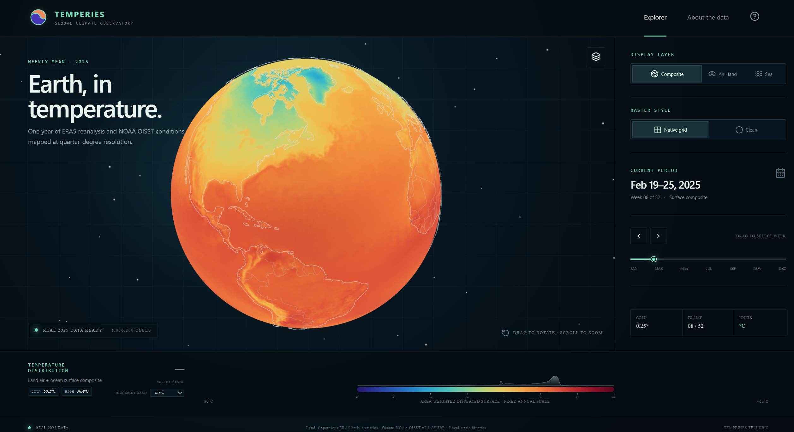
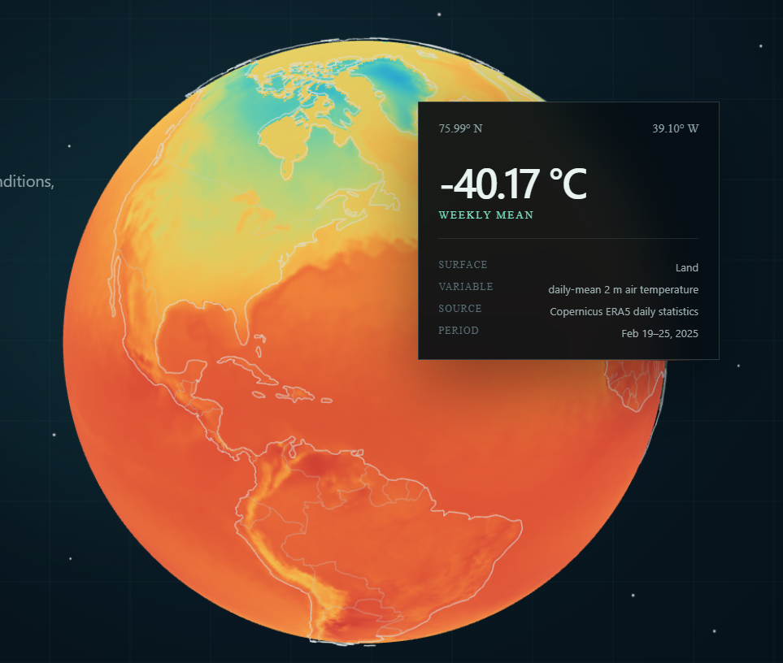
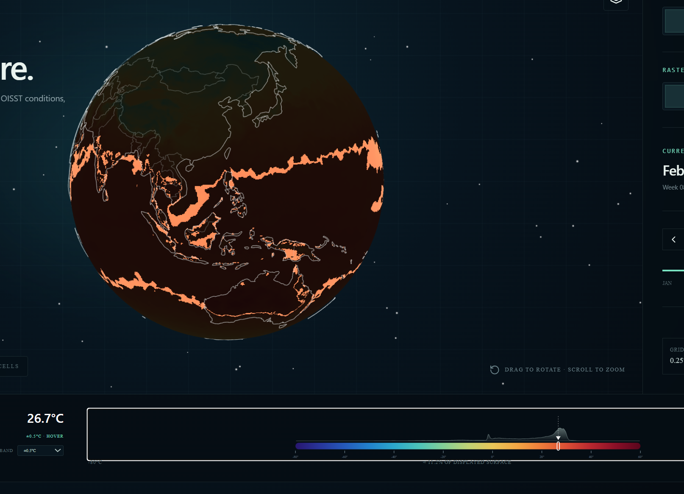
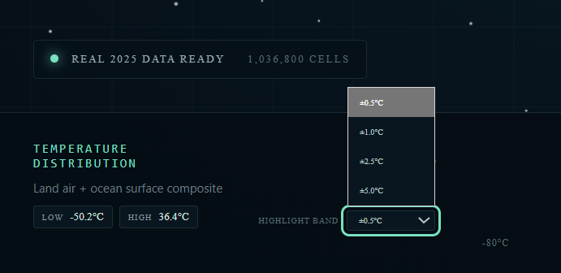
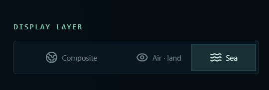
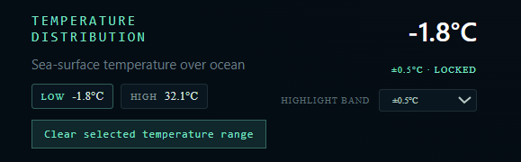
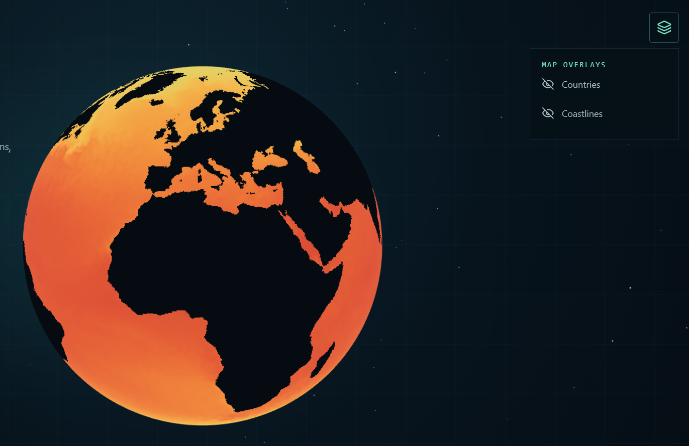

# Temperies

[](https://github.com/unguisdraconis/temperies/actions/workflows/deploy.yml)

Temperies is an interactive globe and flat-map explorer for weekly 2025 land-air and sea-surface temperatures. A coordinated D3 legend and Three.js view let the reader inspect individual quarter-degree cells, select temperature bands, and see where matching conditions occur around the world.

**[Explore the live application](https://unguisdraconis.github.io/temperies/)**



> The displayed fields combine Copernicus ERA5 daily-mean 2 m air temperature with NOAA OISST v2.1 daily sea-surface temperature, aggregated into weekly means. ERA5 is a reanalysis product and OISST is an analysis product; neither is a direct point-observation dataset.

## What you can explore

- Morph between the 3D globe and the raster's native Plate Carrée map without reloading data or losing the selected week and temperature range.
- Hover either view to inspect a cell's coordinates, surface type, weekly mean temperature, source, and period.
  
- Hover or select the legend to highlight matching temperatures globally without scanning the raster in JavaScript.
  
- Choose a highlight band of ±0.5 °C, ±1.0 °C, ±2.5 °C, or ±5.0 °C. A locked selection remains active when the period changes.
  
- Switch between the land-air and ocean-SST composite, land-air only, and ocean-SST only.
  
- Jump to the spatial low or high of the selected week's mean field. These are extrema of weekly means, not instantaneous weather records.
  
- Move through 52 periods covering all 365 days of 2025, with a loading indicator while a requested field is prepared.
  
- Show or hide borders and coastlines, switch between native-cell and clean rendering, and display temperatures in Celsius or Fahrenheit.
  

## Scientific scope

- **Composite:** ERA5 2 m air temperature outside the invariant OISST ocean footprint plus OISST sea-surface temperature over supported ocean cells.
- **Air · land:** ERA5 2 m air temperature over the air-routed surface mask; ocean cells are intentionally unsupported.
- **Sea:** OISST sea-surface temperature over supported ocean cells; all other cells are intentionally unsupported.

The composite is a surface overview assembled from two physically different variables. It should not be treated as a single homogeneous observational record or as a climate-change attribution product. All modes use the same fixed −80 °C to +60 °C annual color scale so colors remain comparable between weeks.

The canonical raster is a 1440 × 720 regular latitude–longitude grid with 0.25° cell spacing. Canonical UV coordinates sample the same raster while a vertex shader morphs between spherical positions and the native Plate Carrée plane. Borders and coastlines carry corresponding sphere and map positions and split at the antimeridian. Plate Carrée enlarges polar screen area; legend populations and percentages remain cosine-of-latitude area weighted.

### Globe and map views

The **View** control changes only the geometry used to display the current field. The loaded temperature textures, surface-routing mask, fixed color scale, selected period, display layer, and locked temperature highlight are shared by both views, so switching projections does not request or decode another raster.

- **Globe** is the default view. Drag to rotate it and scroll or pinch to zoom.
- **Map** unfolds the same raster into its native 2:1 Plate Carrée layout. Drag to pan and scroll or pinch to zoom.
- The temperature surface, borders, and coastlines follow the same GPU-driven morph. Map hover uses the same canonical grid coordinates as globe hover.
- If the operating system requests reduced motion, Temperies changes views without the animated morph.

The map is valuable for seeing the complete raster at once, but it is not equal-area. Apparent polar size must not be read as geographic area; legend percentages retain their area weighting regardless of the selected view.

See [Data sources and methodology](DATA_SOURCES.md) for citations, source terms, processing choices, and interpretation limits. The compact [2025 provenance record](docs/data-provenance-2025.md) preserves validation totals and checksums.

## Architecture

- `src/climate` owns the canonical grid, temperature encoding, runtime manifest validation, explicit little-endian binary parsing, URL construction, frame loading, in-flight deduplication, and five-frame LRU cache.
- `src/globe` owns React Three Fiber rendering, numeric data textures, the globe-to-Plate-Carrée projection morph, endpoint-specific picking, shader filtering, tooltips, and independent vector overlays.
- `src/legend` owns the shared annual palette, D3 scale and histogram path, pointer inversion, keyboard interaction, and mode-consistent area calculations.
- `src/app` owns semantic application state and atomic frame transitions. Per-frame rendering values do not flow through React state.
- `scripts/real_data` owns source acquisition, canonical-grid alignment, weekly aggregation, encoding, and validation.
- `scripts/generate-data.ts` regenerates a separate deterministic synthetic test dataset. It is never run by install, test, or build.

The CPU determines which cell or temperature the user requests. The GPU determines where the selected temperature occurs globally.

The default **Native grid** style draws derivative-antialiased 0.25° cell boundaries in the fragment shader. Boundaries fade when their projected footprint becomes too small. **Clean** hides only those boundaries and retains the same nearest-sampled climate textures.

## Validation

Every push to `main` runs the following checks before GitHub Pages deployment:

```bash
npm run typecheck
npm run lint
npm test
npm run build
```

The test suite covers grid edges and seams, projection endpoints, antimeridian vector handling, binary encoding, manifest rejection, raster dimensions, loading failures and stale requests, LRU behavior, texture configuration, shader contracts, CPU temperature lookup, reducer behavior, and legend and view-control interaction. These checks do not constitute a formal accessibility audit or a browser-performance benchmark.

The interface includes visible keyboard focus, a keyboard-operable temperature selector, status and error announcements, accessible control names, and reduced-motion handling. No claim of WCAG conformance is made.

## Run locally

Use Node.js 22, matching the deployment workflow.

```bash
npm ci
npm run dev
```

Additional commands:

```bash
npm run build
npm run preview
npm run generate:data
npm run typecheck
npm run lint
npm test
npm run test:watch
```

`npm run generate:data` recreates the isolated synthetic fixture under `public/synthetic/data/2025`; it does not overwrite the default real dataset. Open it with `?dataset=synthetic`. The checked-in default is the validated real dataset under `public/data/2025`.

The [real-data pipeline](docs/real-data-pipeline.md) documents a resumable acquisition and processing workflow for NOAA OISST and Copernicus ERA5. Reproducing the ERA5 acquisition requires a Climate Data Store account and acceptance of the applicable dataset terms.

## Data contract

Each temperature raster contains 1,036,800 little-endian `Uint16` values (2,073,600 bytes). Values use `temperatureC = encoded × 0.01 − 100`; `65534` is reserved and `65535` is missing. The surface-routing mask contains 1,036,800 `Uint8` values, where `0` selects OISST and `1` selects ERA5 air temperature.

## Project role

Temperies was designed and directed by Jeremiah King, including the product concept, interaction decisions, visual direction, climate-data methodology, and validation requirements. Implementation was developed with AI-assisted coding using ChatGPT and Codex. Repository history records the resulting code and documentation but is not, by itself, evidence that every line was independently authored.

## Licensing

The source code is available under the [MIT License](LICENSE).

That licence does **not** apply to the TEMPERIES name, wordmark, logo, favicon, or other brand assets; screenshots or promotional artwork; climate datasets or derived data products; or third-party geographic and software assets. Those materials retain their applicable copyright or source-specific terms.

See [Licensing scope and third-party material](NOTICE.md) for the boundary between MIT-licensed code and excluded material. Climate and map data sources, citations, and terms are documented in [Data sources and methodology](DATA_SOURCES.md).
